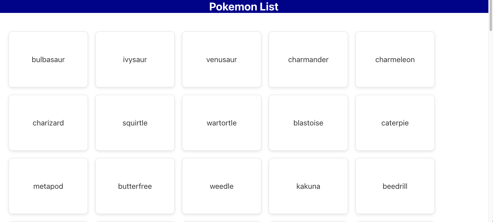

# pokemon-ai

This project show the capability of AAID (AI Driven Development).

### This Repo is created/generated (90%~) from ChatGPT.

The main goals is to show a pokemon List with page details per each pokemon.

I want to show how work with your Generative AI Buddy (in this example Chat GPT), can be benifical for you as a developer and make you built a consist application that easy to maintain, read and test.

### Here is the PPT With All prompts and results
TBD

### The process

## screenshots

